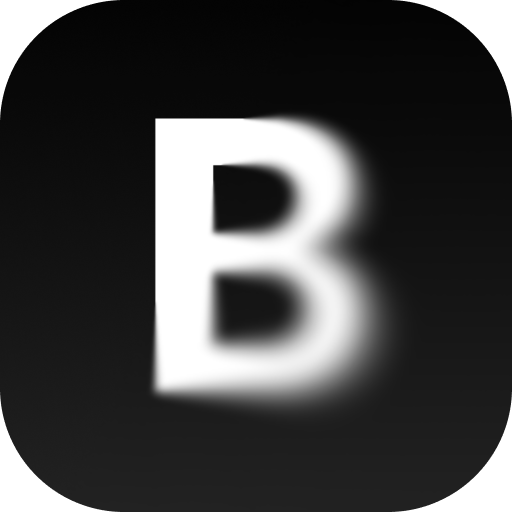

<p align="center">
  
</p>

<h1 align="center">BlurHash Generator</h1>

<p align="center">Raycast extension to generate blurhash strings from images and videos.</p>

---

Copy a file in Finder or an image from anywhere, run the command, get the hash. That's it.

**Output** is a single copyable line:

```
filename.jpg 1920x1080 16:9 LKO2?U%2Tw=w]~RBVZRi...
```

## Features

- Reads images and videos from clipboard, Finder copy, or Finder selection
- Falls back to a native file picker or Clipboard History
- Shows a decoded blurhash preview alongside file metadata
- Supports JPEG, PNG, GIF, BMP, WebP, TIFF, HEIC, AVIF, MP4, MOV, MKV, and more

## Requirements

Requires [ffmpeg](https://formulae.brew.sh/formula/ffmpeg):

```
brew install ffmpeg
```
