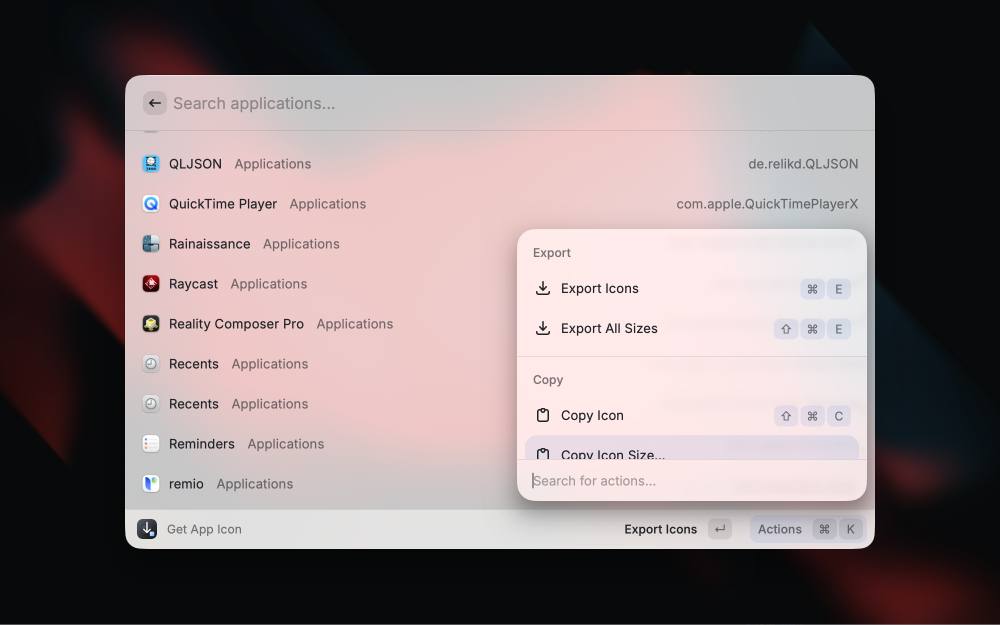
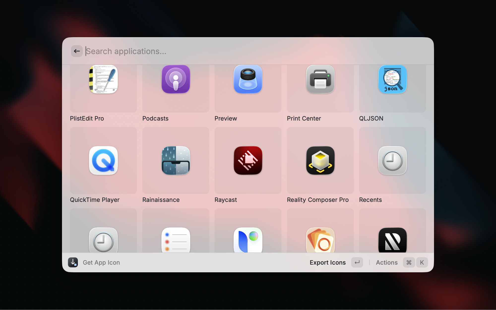

# Get App Icon

Quickly save or copy an app's icon in multiple sizes and formats.

  
  
  

## How It Works

The command lists all installed macOS applications (sorted alphabetically) in a list or grid view.

Icons are extracted using macOS `NSWorkspace`, which resolves the correct icon for every app — including those using Asset Catalogs — just like Finder does.

Each app gets its own folder under the configured output path, with format-specific subdirectories (PNG, JPEG, ICNS).

## Preferences

- **Default View**: Choose whether to display applications as a list or grid. You can also toggle views on the fly with `⌘G` / `⌘L`.
- **Output Folder**: Base folder to store exported icons. Defaults to `~/Downloads/`.
- **Export Formats**: Choose between PNG (default), JPEG, or ICNS (original `.icns` file). Multiple formats can be enabled at once.
- **Export Icon Sizes**: Enable the sizes you want exported (16, 32, 48, 64, 128, 256, 512, 1024 px). If none are selected, 512px is used.

## Actions

### Export

- **Export Icons** (`⌘E`): Exports all enabled sizes to the app's folder in the configured formats.
- **Export All Sizes** (`⌘⇧E`): Exports every size (16–1024) regardless of preferences, as a one-off.

### Copy

- **Copy Icon** (`⌘⇧C`): Copies the app icon at the largest enabled size to the clipboard as an image. You can paste it directly into design tools, documents, or chat apps.
- **Copy Icon Size…**: Opens a submenu to pick a specific size, then copies that icon to the clipboard.
- **Copy App Path** (`⌘.`): Copies the full path to the `.app` bundle.
- **Copy App Name** (`⌘⇧.`): Copies the app's display name.
- **Copy Bundle Identifier**: Copies the app's bundle ID (e.g. `com.apple.Safari`).

### View

- **View as Grid** (`⌘G`) / **View as List** (`⌘L`): Toggle between list and grid views. Your choice is remembered across sessions.

### App

- **Show in Finder** (`⌘↩`): Reveals the app in Finder.
- **Show Info in Finder** (`⌘I`): Opens the Finder info window for the app.
- **Show Export Folder in Finder** (`⌘F`): Opens the app's export folder in Finder (if icons have been exported).

## Limitations

- **ICNS export is not available for all apps.** Some modern macOS apps use Asset Catalog icons (`Assets.car`) instead of traditional `.icns` files. PNG and JPEG export works for all apps, but ICNS export requires the original `.icns` file to be present in the app bundle.
- **Upscaling may occur.** When exporting at sizes larger than the app's native icon resolution, the extracted icon may appear blurry.
