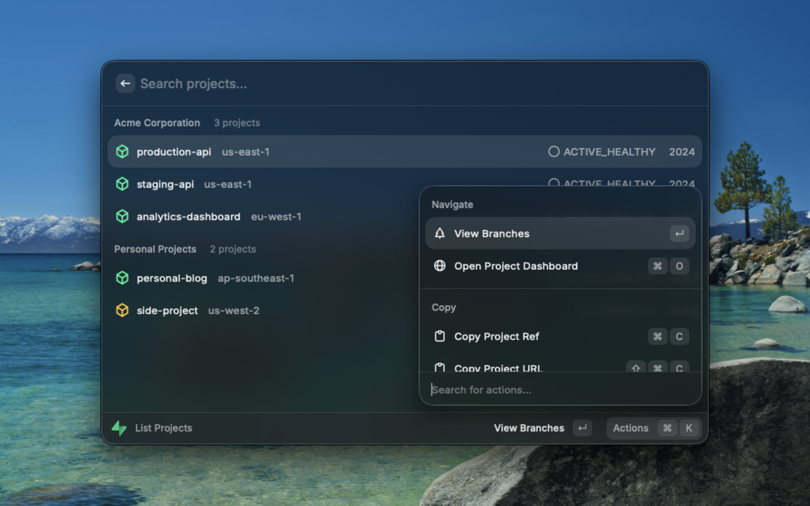
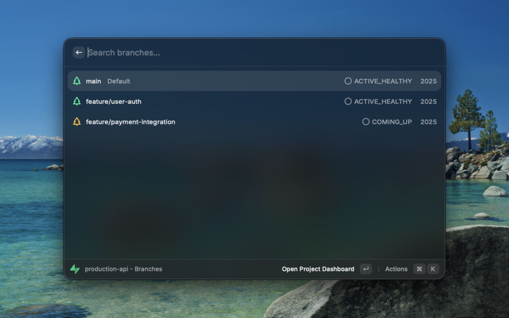
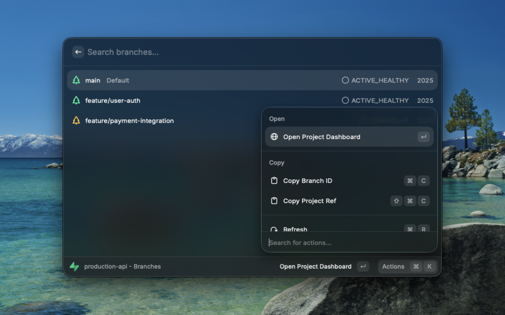

# Supabase

Browse and manage your Supabase projects and database branches directly from Raycast.

## Features

- View all projects across organizations
- Browse database branches
- Quick access to Supabase Dashboard
- Copy project references and URLs

## Setup

1. Get your access token from [Supabase Dashboard](https://supabase.com/dashboard/account/tokens)
2. Open Raycast preferences and paste the token

## Commands

### List Projects

Browse all your Supabase projects grouped by organization.

- **View Branches**: Navigate to see database branches for a project
- **Open Dashboard**: Open the project in Supabase Dashboard
- **Copy Project Ref**: Copy the project reference ID
- **Copy Project URL**: Copy the dashboard URL

## Screenshots

## Credits

- Icon from [Dashboard Icons](https://dashboardicons.com/) by [homarr-labs](https://github.com/homarr-labs/dashboard-icons), licensed under [Apache License 2.0](https://www.apache.org/licenses/LICENSE-2.0)
