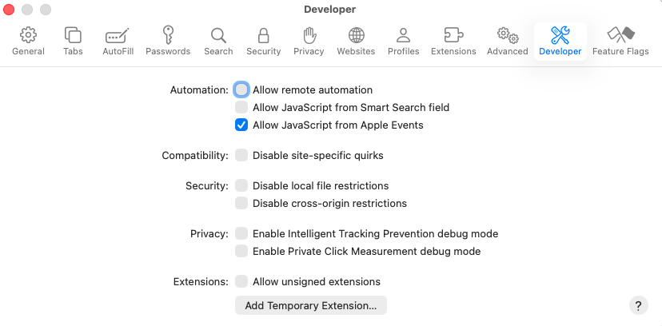
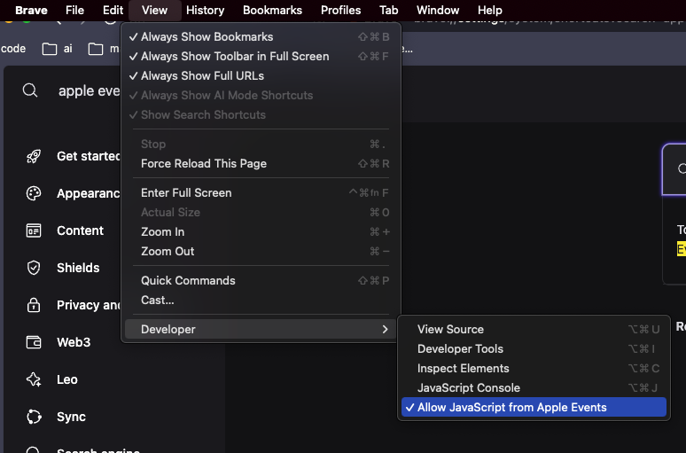

# YouTube Music

Control the YouTube Music tab in the browser with your keyboard.

## Required Setup

The extension controls your browser via AppleScript by running JavaScript in the YouTube Music tab. You must enable **Allow JavaScript from Apple Events** in the browser you select in the extension preferences; otherwise commands will fail (often with "Unknown Error").

### Safari

1. Enable the Develop menu: **Safari → Settings → Advanced** → check **Show features for web developers**.
2. Turn on **Develop → Allow JavaScript from Apple Events**.

### Chrome, Chromium, or WebCatalog apps

1. Open **View → Developer** in the menu bar.
2. Enable **Allow JavaScript from Apple Events**.

After enabling this setting, pick the same browser (or WebCatalog app) in the extension’s **Browser where YouTube Music opened** preference.

---

Credit to [@alexstrnik](https://www.raycast.com/alexstrnik) for the [Yandex Music](https://www.raycast.com/alexstrnik/yandex-music) extension which this extension was based on.
